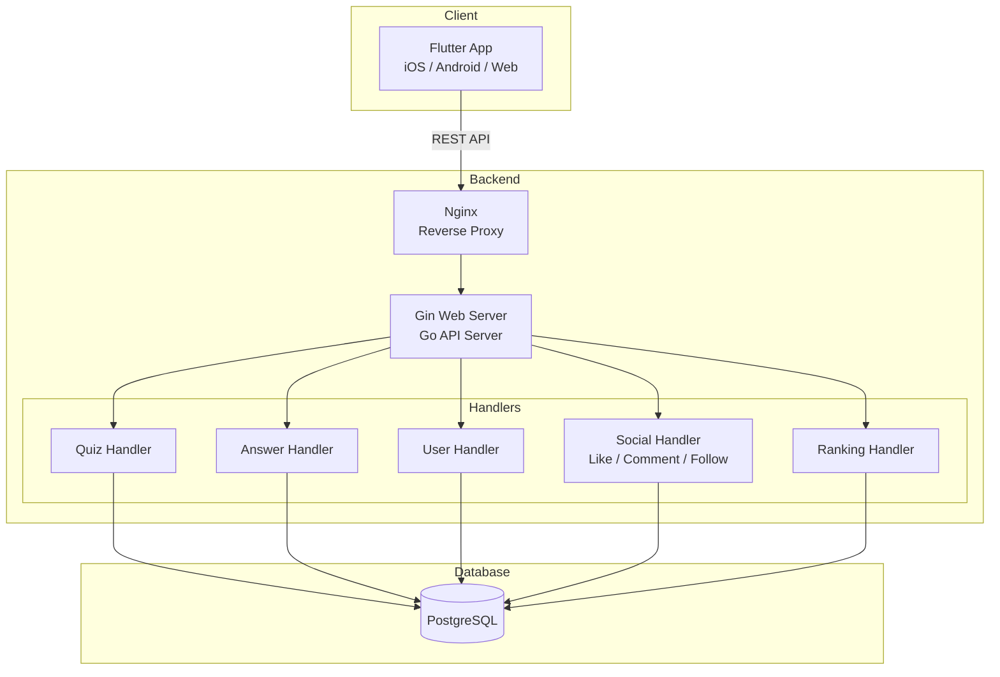
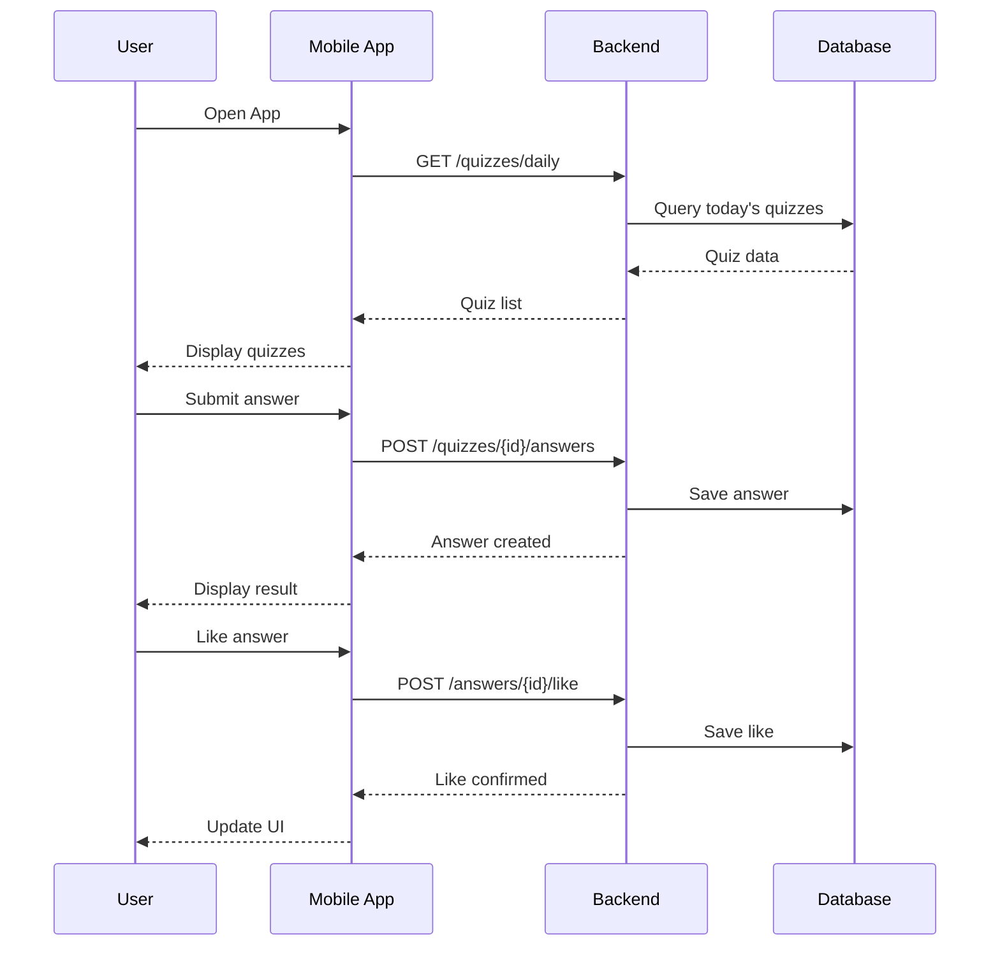

# Serifu (serifu)

毎日のクイズで創作力を発揮するSNSアプリ

A Quiz + SNS platform for daily creative scenarios and social interaction.

## Overview

Serifuは、AIが生成するシチュエーションに対してウィットに富んだセリフを投稿し、コミュニティと交流するSNSアプリです。毎日5つのクイズが出題され、150文字以内でセリフを投稿。いいね、コメント、フォローで他のユーザーと繋がります。

## Features

### Core Features
- **デイリークイズ** - 毎日5つのシチュエーションクイズが出題
- **セリフ投稿** - 150文字以内でクリエイティブなセリフを作成
- **カテゴリー分類** - 日常、仕事、恋愛、友達、家族、ユーモア、哲学、モチベーション

### SNS Features
- **タイムライン** - 他のユーザーの回答を閲覧
- **いいね** - 優れた回答に「いいね」
- **コメント** - 回答にコメント
- **フォロー** - ユーザーをフォロー
- **ランキング** - デイリー/ウィークリー/全期間のランキング
- **トレンド** - バズっている回答を発見

## Tech Stack

### Mobile
- Flutter (Dart)
- Provider (State Management)

### Backend
- Go
- Gin (Web Framework)
- GORM (ORM)
- PostgreSQL

### Infrastructure
- Docker
- Docker Compose
- Nginx (Production)

## Architecture



### Data Flow



## Project Structure

```
serifu/
├── doc/
│   ├── backend-deployment.md
│   ├── files/
│   │   └── quiz_sns_app_ui_design.md
│   └── memo/
│       └── prompt.md
└── sys/
    ├── backend/
    │   ├── docker-compose.dev.yml
    │   ├── docker-compose.prod.yml
    │   ├── nginx/
    │   │   └── nginx.conf
    │   └── app/
    │       ├── main.go
    │       ├── Dockerfile
    │       └── internal/
    │           ├── config/
    │           ├── database/
    │           ├── handlers/
    │           ├── middleware/
    │           ├── router/
    │           └── utils/
    └── frontend/
        └── user/
            └── mobile/
                └── serifu/        # Flutter App
                    ├── lib/
                    │   ├── api/
                    │   ├── models/
                    │   ├── screens/
                    │   ├── widgets/
                    │   └── repositories/
                    └── pubspec.yaml
```

## Getting Started

### Prerequisites

- Docker & Docker Compose
- Go 1.21+ (for local development)
- Flutter SDK (for mobile development)

### Run with Docker

```bash
cd sys/backend

# Start all services
docker-compose -f docker-compose.dev.yml up -d

# View logs
docker-compose -f docker-compose.dev.yml logs -f
```

### Services

| Service | URL | Description |
|---------|-----|-------------|
| Backend API | http://localhost:8080 | Go API Server |
| Adminer | http://localhost:5050 | Database Admin UI |
| PostgreSQL | localhost:5432 | Database |

### Seed Data

```bash
docker exec -i serifu_postgres_dev psql -U serifu -d serifu_db < app/seeds/seed_data.sql
```

### Flutter Development

```bash
cd sys/frontend/user/mobile/serifu

# Run app
flutter run
```

## License

MIT

## Author

たのしみdev with Claude Code
